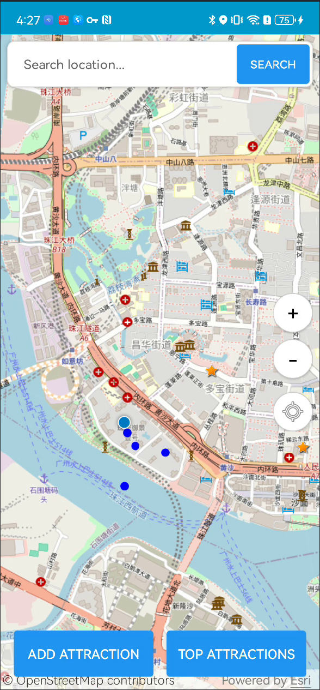
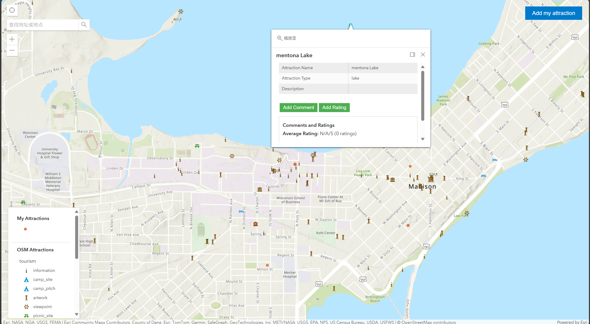
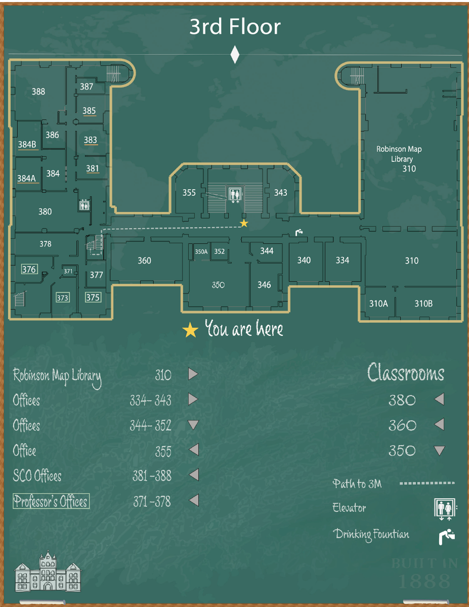
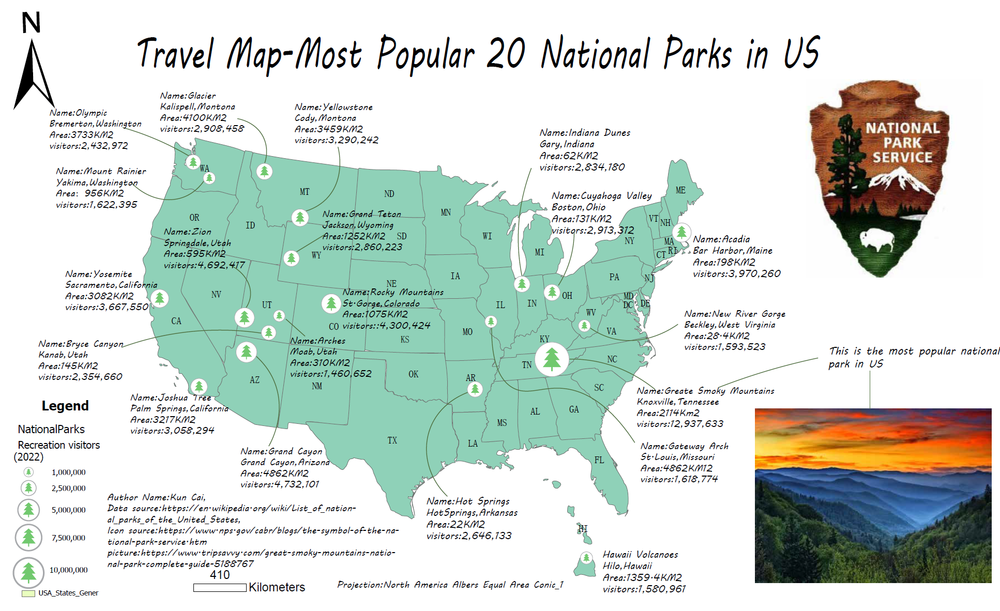

Welcome
I am a GIS developer and cartographer who turns data into clear maps and applications. This portfolio collects graduate coursework and independent projects across cartography, web GIS, Android development, spatial databases, and analysis. It is easy to browse on mobile and simple to share.

Navigation
[Projects](#projects) · [Achievements](achievements.md) · [Skills](skills.md) · [Resume](resume.md) · LinkedIn: https://www.linkedin.com/in/REPLACE_WITH_YOUR_ID

What you will find here
- Print-ready cartography with downloadable PDFs
- Interactive web maps and an Android app demo
- Spatial analysis reports with methods and results
- A running list of achievements and a concise skills summary
- A resume and a direct link to my LinkedIn profile

Featured projects
(thumbnails below are not links; use the md links to open each project page)

TourGuideApp — Global attractions with ratings (Android + ArcGIS Runtime)

Open project page → [projects/TourGuideApp.md](projects/TourGuideApp.md)

Interactive Web Map — Add and Rate Attractions (ArcGIS JS 4.24)

Open project page → [projects/Interactive-Web-Map.md](projects/Interactive-Web-Map.md)

GEOG 475 — Science Hall Floor 3 and Mezzanine Wayfinding

Open project page → [projects/GEOG475-Wayfinding-Science-Hall.md](projects/GEOG475-Wayfinding-Science-Hall.md)

US Top 20 National Parks by Recreation Visits

Open project page → [projects/national-parks.md](projects/national-parks.md)

GEOG 574 — Asthma Research Database
Open project page → [projects/GEOG574-Asthma-Research.md](projects/GEOG574-Asthma-Research.md)

GEOG 578 — Health Accessibility in Dane County
Open project page → [projects/GEOG578-Health-Accessibility-Dane-County.md](projects/GEOG578-Health-Accessibility-Dane-County.md)

Projects
- [projects/national-parks.md](projects/national-parks.md)
- [projects/Interactive-Web-Map.md](projects/Interactive-Web-Map.md)
- [projects/TourGuideApp.md](projects/TourGuideApp.md)
- [projects/GEOG475-Wayfinding-Science-Hall.md](projects/GEOG475-Wayfinding-Science-Hall.md)
- [projects/GEOG574-Asthma-Research.md](projects/GEOG574-Asthma-Research.md)
- [projects/GEOG578-Health-Accessibility-Dane-County.md](projects/GEOG578-Health-Accessibility-Dane-County.md)

Assignment checklist
- Showcases accomplishments and talents across six projects
- Media-rich: images, PDFs, one embedded video, and a live web map
- Exhibits maps, web apps, an Android app, and GIS analysis work
- Tracks achievements on a dedicated page and lists skills concisely
- Provides a resume download and a direct link to LinkedIn

Contact
Email: caikun192@gmail.com
