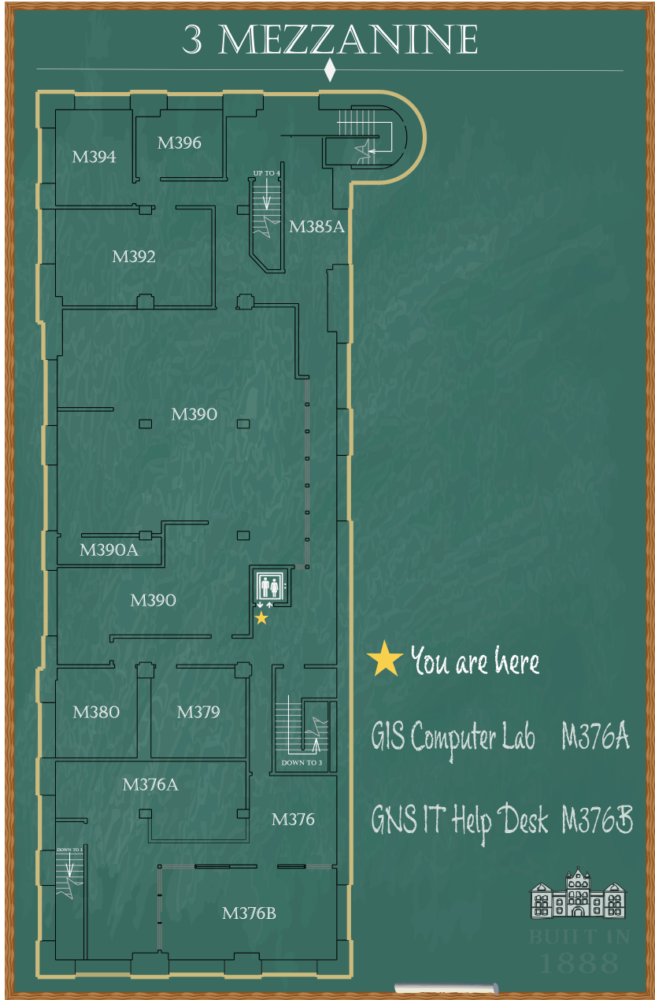

Project name
Science Hall Floor 3 and Mezzanine Wayfinding

Course and team
GEOG 475 group project. Team: Mike Huang, Kun Cai, Jack Dipaolo, Peter Vajagich.

My role
Cartographic production for the core third-floor map and the mezzanine map; typography and color specification; layout polishing; co-design of the directional signage and placement plan; documentation and QA.

Objective and scope
Develop a new, creative, and easy-to-understand wayfinding map for newcomers to Science Hall’s third floor, with a special emphasis on clearly identifying how to reach the third-floor mezzanine (3M). The work is split into two parts: 1) redesigning layout, style, and user experience; 2) assembling all components into a complete wayfinding package. This aligns with the brief “Wayfinding on Floor 3 and the mezzanine” and the goal to modernize legibility while nodding to the building’s old-school character. :contentReference[oaicite:0]{index=0}

Design language
Chalkboard-inspired theme for the maps to evoke Science Hall’s historic classroom feel; a gold star marks “You are here.” Primary color is mystic green (matching the roof points), paired with Ecru (a goldish yellow) as the true secondary; supporting accents include white, orange, and tea green sourced from the building context. :contentReference[oaicite:1]{index=1}

Typography
For signage, the design retains the spirit of prior signs using Casteller and Hey Mom! with adjustments for clarity and consistency. For the maps, Chalky delivers the chalk-on-board texture, paired with Casteller to keep a formal, historical tone. :contentReference[oaicite:2]{index=2}

Core third-floor map (overview)
Placed at the top of the stairs and just outside the elevator for maximum visibility. Shows the entire floor with labeled important spaces: SCO offices, Robinson Map Library, faculty offices, and a dedicated classroom section; because there are only three classrooms, each receives individual visual emphasis. Amenities such as the drinking fountain are symbolized. The route to the mezzanine is clearly highlighted to fix prior ambiguity. The map uses the chalkboard style and the gold “You are here” star for quick orientation. :contentReference[oaicite:3]{index=3}

Mezzanine (3M) map
A complementary 3M map built with the same chalkboard style now provides clear room-level guidance inside the mezzanine, which previously lacked its own map. :contentReference[oaicite:4]{index=4}

Directional signage system
Motivation: existing signs were outdated, missing key room numbers, or sometimes pointed incorrectly. The new system defines three strategic placements to reduce confusion:
1) at the 3M entrance as you walk up the staircase
2) in the south wing of the third floor before you climb the stairs to 3M
3) deeper inside the mezzanine to guide visitors further
A custom layout formula 14 + (7 × number of rows) was used to structure directional text blocks and spacing, while arrows were manually crafted for accuracy and visual clarity. :contentReference[oaicite:5]{index=5}

Preview and downloads
Open PDF overview: [../assets/docs/Floor3Main.pdf](../assets/docs/Floor3Main.pdf)
Open core map image: [../assets/img/wayfinding-core.jpg](../assets/img/wayfinding-core.jpg)
Open mezzanine map image: [../assets/img/wayfinding-3m.jpg](../assets/img/wayfinding-3m.jpg)

Inline previews (click images to open)

Method and workflow
1. Inventory and problem framing: audit existing maps and signs; identify missing or misleading information around 3M access.
2. Visual system: define chalkboard theme, color set (mystic green, Ecru, supportive neutrals), and font pairing for maps and signs.
3. Cartography: compile floor footprints, room labels, destinations and amenities; add “You are here” locator and the 3M route.
4. Signage design: set directional text grids with the 14 + (7 × rows) formula; hand-tune arrows and spacing for legibility.
5. Placement plan: place core map at stairs/elevator, add pre-3M and in-3M signs at the specified positions; test sightlines.
6. QA and export: spell-check room numbers and names; export high-res images for print and web; produce a single PDF package.

Results and impact
Newcomers to Science Hall can quickly answer two key questions: where am I, and how do I reach the mezzanine from here. The system improves legibility at decision points, reduces backtracking, and brings a coherent historic-modern aesthetic to the third floor. :contentReference[oaicite:6]{index=6}

File locations used on this page
PDF package path: ../assets/docs/Floor3Main.pdf
Core map image path: ../assets/img/wayfinding-core.jpg
Mezzanine map image path: ../assets/img/wayfinding-3m.jpg

Next steps
Add bilingual labels as needed, include accessibility icons, test with first-time visitors, and iterate on symbol sizes for long corridors. Optionally publish an interactive floor viewer with clickable rooms and search.

Back link
Return to home page: ../index.md
